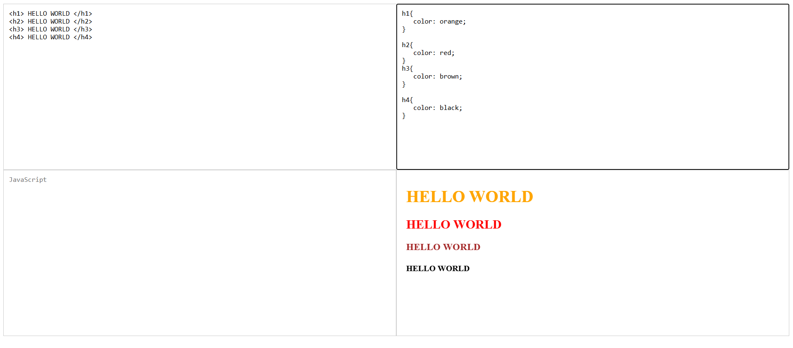

# Code Editor

A simple, live HTML, CSS, and JavaScript code editor built using basic web technologies. This application allows users to write and preview HTML, CSS, and JavaScript code in real-time directly in the browser.

## ✨ Features

- Live preview of HTML, CSS, and JavaScript
- Separate editors for each language
- Auto-update of output as you type
- Responsive and user-friendly layout

## 🛠️ Technologies Used

- **HTML5**
- **CSS3**
- **JavaScript (Vanilla)**

## 📁 Project Structure

```
code-editor/
  │
  ├── index.html # Main HTML file with editor layout
  ├── styles.css # Styles for editor and output
  └── script.js # Logic to update the output iframe
```

## 🚀 How to Run

1. Clone the repository or download the files.
2. Open `index.html` in your preferred browser.
3. Start typing your HTML, CSS, and JavaScript in the respective editors.
4. See the live output on the right side of the screen.

## 📸 Screenshot



## 🔧 Customization to be done later

You can easily enhance the editor by:
- Adding syntax highlighting using a library like [CodeMirror](https://codemirror.net/) or [Monaco Editor](https://microsoft.github.io/monaco-editor/)
- Adding Save/Download functionality
- Introducing theme switcher (light/dark mode)

---

Feel free to fork and contribute!

